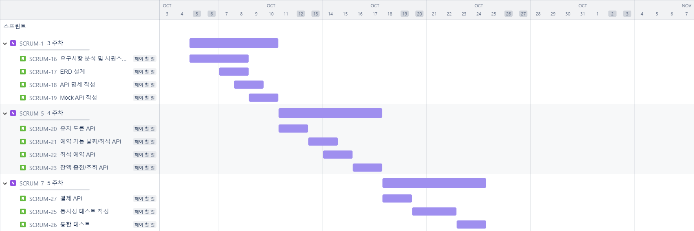
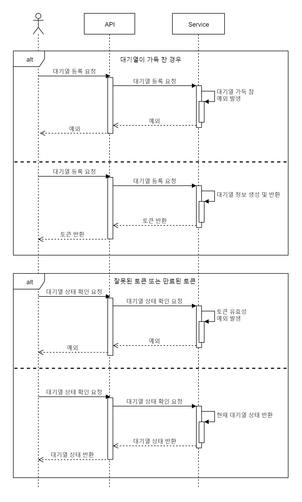
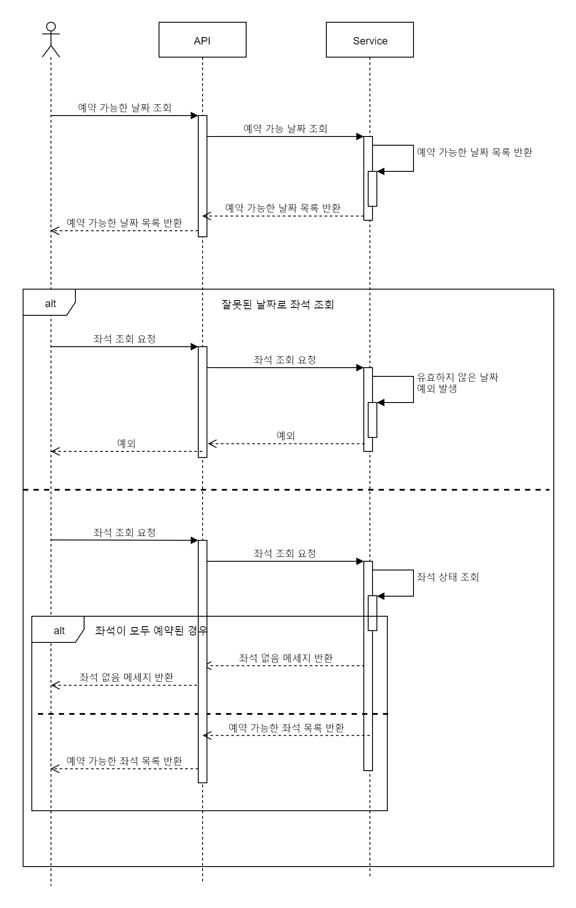
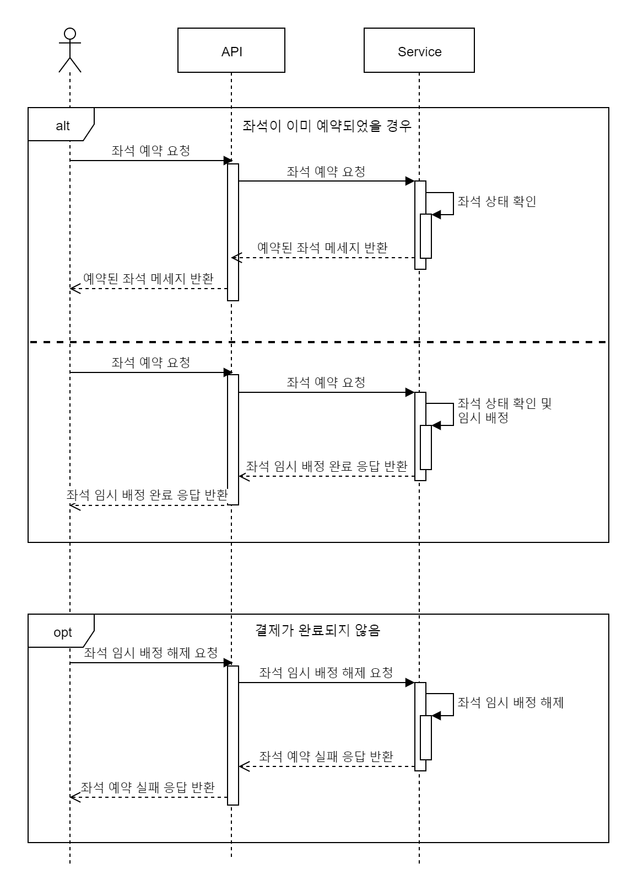
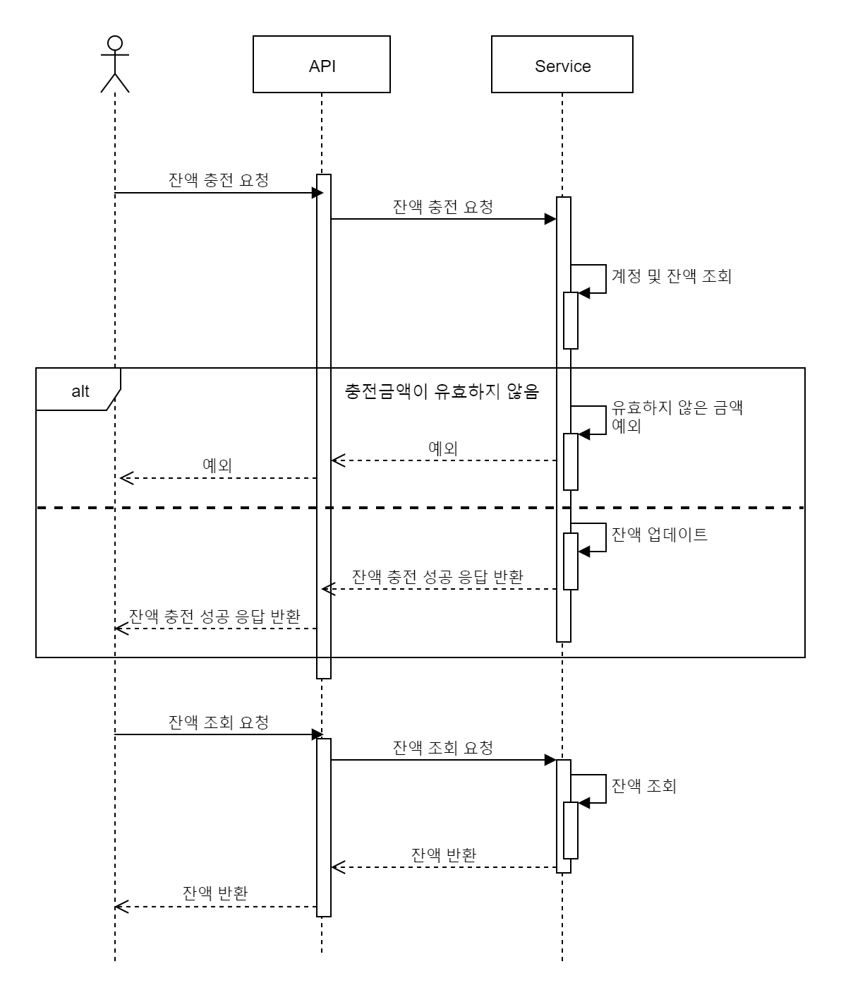
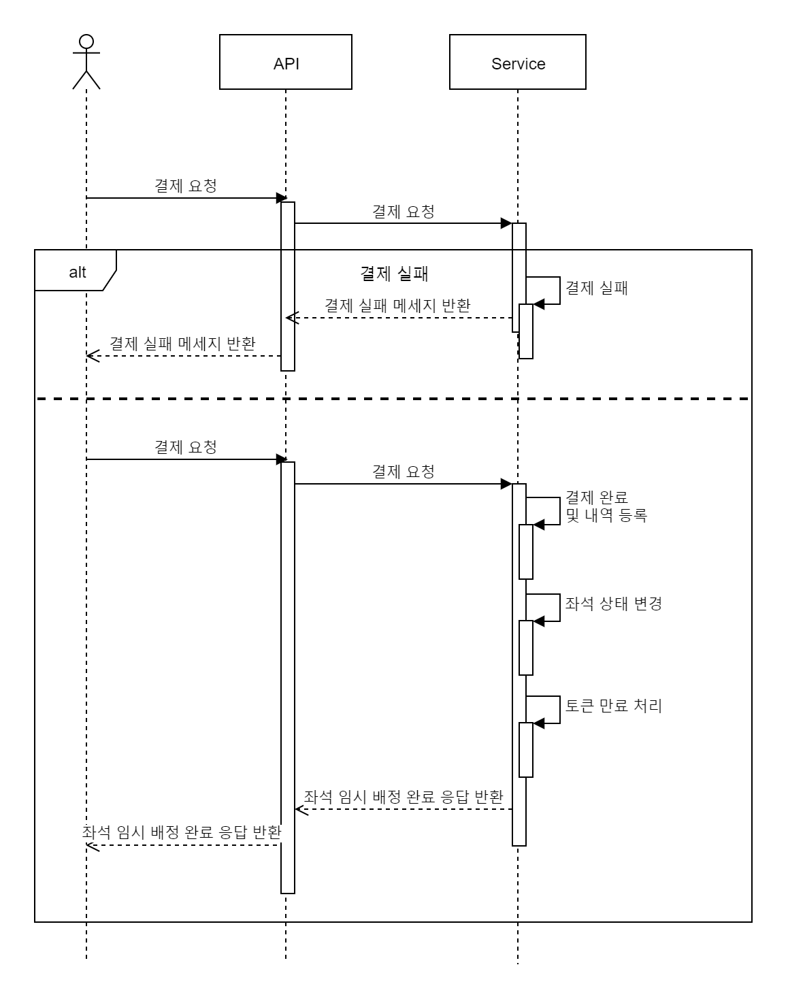
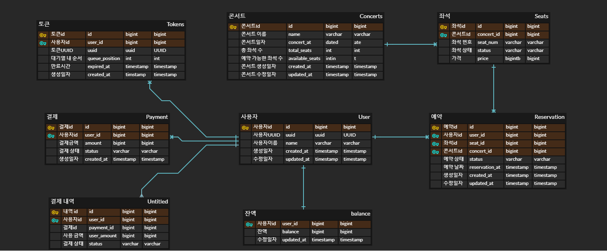

<details>
<summary>콘서트 예약 서비스</summary>

# 콘서트 예약 서비스

- `콘서트 예약 서비스`를 구현해 봅니다.
- 대기열 시스템을 구축하고, 예약 서비스는 작업가능한 유저만 수행할 수 있도록 해야합니다.
- 사용자는 좌석예약 시에 미리 충전한 잔액을 이용합니다.
- 좌석 예약 요청시에, 결제가 이루어지지 않더라도 일정 시간동안 다른 유저가 해당 좌석에 접근할 수 없도록 합니다.

</details>

<details>
<summary>요구사항</summary>

## 요구사항

- 아래 5가지 API 를 구현합니다.
  - 유저 토큰 발급 API
  - 예약 가능 날짜 / 좌석 API
  - 좌석 예약 요청 API
  - 잔액 충전 / 조회 API
  - 결제 API
- 각 기능 및 제약사항에 대해 단위 테스트를 반드시 하나 이상 작성하도록 합니다.
- 다수의 인스턴스로 어플리케이션이 동작하더라도 기능에 문제가 없도록 작성하도록 합니다.
- 동시성 이슈를 고려하여 구현합니다.
- 대기열 개념을 고려해 구현합니다.
</details>

<details>
<summary>API 스펙</summary>

## API 스펙

**1️⃣ `주요` 유저 대기열 토큰 기능**

- 서비스를 이용할 토큰을 발급받는 API를 작성합니다.
- 토큰은 유저의 UUID 와 해당 유저의 대기열을 관리할 수 있는 정보 ( 대기 순서 or 잔여 시간 등 ) 를 포함합니다.
- 이후 대기열에 의해 **보호받는** 모든 API 는 위 토큰을 이용해 대기열 검증을 통과해야 이용 가능합니다.
- **내 대기번호를 조회하는 폴링용 API를 작성합니다.**

> 기본적으로 폴링으로 본인의 대기열을 확인한다고 가정하며, 다른 방안 또한 고려해보고 구현해 볼 수 있습니다.
>

**2️⃣ `기본` 예약 가능 날짜 / 좌석 API**

- 예약가능한 날짜와 해당 날짜의 좌석을 조회하는 API 를 각각 작성합니다.
- 예약 가능한 날짜 목록을 조회할 수 있습니다.
- 날짜 정보를 입력받아 예약가능한 좌석정보를 조회할 수 있습니다.

> 좌석 정보는 1 ~ 50 까지의 좌석번호로 관리됩니다.
>

**3️⃣ `주요` 좌석 예약 요청 API**

- 좌석 예약과 동시에 해당 좌석은 그 유저에게 약 5분간 임시 배정됩니다. ( 시간은 정책에 따라 자율적으로 정의합니다. )
- 날짜와 좌석 정보를 입력받아 좌석을 예약 처리하는 API 를 작성합니다.
- 만약 배정 시간 내에 결제가 완료되지 않는다면 좌석에 대한 임시 배정은 해제되어야 하며 임시배정 상태의 좌석에 대해 다른 사용자는 예약할 수 없어야 한다.

**4️⃣ `기본`**  **잔액 충전 / 조회 API**

- 결제에 사용될 금액을 API 를 통해 충전하는 API 를 작성합니다.
- 사용자 식별자 및 충전할 금액을 받아 잔액을 충전합니다.
- 사용자 식별자를 통해 해당 사용자의 잔액을 조회합니다.

**5️⃣ `주요` 결제 API**

- 결제 처리하고 결제 내역을 생성하는 API 를 작성합니다.
- 결제가 완료되면 해당 좌석의 소유권을 유저에게 배정하고 대기열 토큰을 만료시킵니다.

</details>

<details>
<summary>마일스톤</summary>

## 마일스톤

</details>

<details>
<summary>시퀀스 다이어그램</summary>

## 시퀀스 다이어그램

### 1. 유저 대기열 토큰 API

### 2. 예약 가능 날짜 API

### 3. 좌석 예약 요청 API

### 4. 잔액 충전 / 조회 API

### 5. 결제 API


</details>

<details>
<summary>ERD</summary>

## ERD

</details>

<details>
<summary>동시성 제어</summary>

### 1. 비관적 락 (Pessimistic Locking) <hr>
비관적 락은 데이터를 수정하기 전에 먼저 락을 걸어 다른 트랜잭션이 해당 데이터를 수정하지 못하게 하는 방법입니다.

#### 적용 방법
SQL 레벨 : 데이터베이스의 SELECT ... FOR UPDATE 쿼리를 사용해 특정 행을 락.

JPA : JPA에서는 @Lock(LockModeType.PESSIMISTIC_WRITE), @Lock(LockModeType.PESSIMISTIC_READ)로 락을 걸 수 있습니다.

**비관적 읽기 락(Pessimistic Read Lock)** : 트랜잭션 동안 다른 트랜잭션이 엔티티를 읽을 수만 있고, 수정은 불가능하도록 잠급니다.</br>
읽기 작업에 대한 경쟁이 치열한 환경에서 데이터 일관성을 보장하고자 할 때 유용합니다.</br>

**사용 예시** : 예약 시스템에서 좌석을 조회하는 상황처럼, 특정 데이터가 읽히고 있는 동안 변경되지 않도록 하고자 할 때 유용합니다.

**비관적 쓰기 락(Pessimistic Write Lock)** : 엔티티를 읽거나 쓰는 동안 다른 트랜잭션의 모든 접근을 차단합니다.</br>
이 모드에서는 엔티티를 수정하려는 트랜잭션만이 접근할 수 있으며, 다른 트랜잭션은 대기합니다.</br>

**사용 예시** : 은행 계좌 잔액처럼 동시에 여러 트랜잭션이 접근할 때 충돌을 절대적으로 막아야 하는 경우 유용합니다.

+ 장점 : 강력한 동시성 제어로 데이터 일관성을 보장할 수 있습니다.


+ 단점 : 락을 획득할 때 다른 트랜잭션이 대기해야 하므로 성능이 저하될 수 있습니다.<br/>
  대량의 동시 트랜잭션이 있는 경우 데드락 발생 가능성이 있습니다.

#### 사용 예시
좌석 예약 시 특정 좌석을 선택하고 FOR UPDATE로 락을 걸어, 동시에 다른 사용자가 같은 좌석을 예약하지 못하도록 합니다.
</br></br>
### 2. 낙관적 락 (Optimistic Locking) <hr>
낙관적 락은 충돌이 자주 발생하지 않을 것이라 가정하고, 트랜잭션 완료 시 데이터가 수정되지 않았는지 확인하여 수정된 경우 롤백하는 방식입니다.

#### 적용 방법

버전 필드: 데이터베이스에 버전(예: version 필드)을 추가해 버전을 증가시키는 방식.
JPA: @Version 어노테이션을 통해 엔티티에 버전을 추가하여 낙관적 락을 사용할 수 있습니다.

+ 장점 : 비관적 락보다 성능이 우수하며, 동시성이 높지 않은 경우 유용합니다.


+ 단점 : 충돌이 발생하면 트랜잭션을 다시 시도해야 하므로, 충돌이 잦은 경우 오히려 성능이 저하될 수 있습니다.<br/>
  재시도 로직을 고려해야 합니다.

#### 사용 예시
유저 잔액 업데이트 시 version 필드를 사용해 잔액을 충전 또는 차감할 때 충돌을 감지합니다. 만약 버전이 변경되었으면 다시 읽어와서 트랜잭션을 재시도합니다.
</br></br>
### 3. 분산 메시지 큐 (Kafka, RabbitMQ 등) <hr>
분산 메시지 큐는 여러 서비스가 독립적으로 동작하도록 하면서 순서와 분리를 보장하는 방법입니다. Kafka를 이용하여 예약 요청을 순차적으로 처리하도록 큐잉하는 방법을 활용할 수 있습니다.

#### 적용 방법

예약, 충전과 같은 트랜잭션 요청을 Kafka 토픽에 Producer로 전송하고, Kafka Consumer가 이를 하나씩 처리하여 동시성 문제를 해결.

+ 장점 : 예약, 충전 요청을 순차적으로 처리하므로 동시성 충돌을 원천적으로 막을 수 있습니다.<br/>
  비동기적으로 메시지를 처리하여 대규모 요청을 효과적으로 처리할 수 있습니다.


+ 단점 : Kafka를 도입하면 시스템이 복잡해지고, 실시간성을 요구하는 서비스에서는 지연이 발생할 수 있습니다.

#### 사용 예시
좌석 예약 요청을 Kafka로 전달하고, Consumer에서 좌석 정보를 조회 후 예약을 처리하여 좌석 중복 예약을 방지.
</br></br>
### 4. 데이터베이스 트랜잭션 격리 수준 <hr>
데이터베이스의 트랜잭션 격리 수준을 설정하여 동시성 문제를 줄일 수 있습니다. 격리 수준을 높이면 트랜잭션 간 데이터 충돌 가능성을 낮출 수 있습니다.

#### 데이터베이스 트랜잭션 격리 수준
1. Read Uncommitted
  + 가장 낮은 격리 수준으로, 한 트랜잭션이 아직 커밋되지 않은 데이터를 다른 트랜잭션이 읽을 수 있습니다. 이를 **"더러운 읽기(Dirty Read)"**라고 하며, 변경이 롤백되면 다른 트랜잭션이 잘못된 데이터를 볼 위험이 있습니다.
  + 장점: 성능이 가장 높지만, 데이터 일관성이 낮습니다.
  + 사용 예시: 데이터의 완전한 일관성이 중요하지 않은 경우나 빠른 읽기 속도가 중요한 애플리케이션에서 사용됩니다.
2. Read Committed
  + 설명: 트랜잭션이 커밋된 데이터만 읽을 수 있도록 하는 격리 수준입니다. 더러운 읽기는 방지하지만, 다른 트랜잭션이 데이터를 수정하면 같은 트랜잭션 내에서도 데이터가 변경될 수 있습니다.
  + 장점: Read Uncommitted보다 일관성이 높고 일반적으로 많은 시스템에서 기본으로 사용됩니다.
  + 단점: 한 트랜잭션이 두 번 동일한 데이터를 조회했을 때, 값이 달라지는 "비반복 읽기(Non-repeatable Read)" 문제가 발생할 수 있습니다.
  + 사용 예시: 대부분의 일반적인 OLTP 시스템에 사용됩니다.
3. Repeatable Read
  + 설명: 트랜잭션 내에서 동일한 데이터를 여러 번 조회하더라도 결과가 동일하도록 보장하는 격리 수준입니다. 더러운 읽기와 비반복 읽기 문제를 모두 방지할 수 있습니다.
  + 단점: 팬텀 읽기(Phantom Read) 현상, 즉 다른 트랜잭션에서 레코드를 삽입하여 새 데이터가 나타날 수 있습니다.
  + 사용 예시: 트랜잭션이 길고 조회의 일관성이 중요한 상황에서 사용됩니다. 예를 들어, 한 사용자가 특정 범위의 좌석을 계속 조회할 때, 그 범위 내 데이터가 일관된 값을 유지해야 하는 경우입니다.
4. Serializable
  + 설명: 가장 높은 격리 수준으로, 트랜잭션이 직렬화된 것처럼 동작하도록 보장합니다. 트랜잭션 간의 완전한 독립성을 보장하여 더러운 읽기, 비반복 읽기, 팬텀 읽기 문제를 모두 해결합니다.
  + 단점: 성능이 가장 낮아지고, 트랜잭션 간 대기 시간이 길어질 수 있습니다.
  + 사용 예시: 좌석 예약과 같이 많은 동시성 요청이 발생하는 경우에도 일관성이 중요한 경우에 적합합니다.

+ 장점 : 동시성 문제가 있는 데이터의 일관성을 보장할 수 있습니다.


+ 단점 : 격리 수준이 높을수록 트랜잭션 대기 시간이 길어져 성능이 저하될 수 있습니다.

#### 사용 예시
좌석 예약과 잔액 사용은 Serializable 수준으로 격리하여 데이터를 동기화하는 방식을 사용할 수 있습니다.
</br></br>
### 5. 분산 락 (ZooKeeper, Redisson) <hr>
분산 락은 Redis 또는 ZooKeeper 같은 외부 분산 시스템을 사용하여 락을 관리하고 동시성 제어를 수행합니다.

#### 적용 방법
Redis의 SETNX 명령으로 분산 락을 구현하거나, Redisson 라이브러리를 사용하여 분산 환경에서 락을 걸 수 있습니다.

+ 장점 : 여러 서버 인스턴스에서 동일한 자원에 대한 락을 공유할 수 있어 분산 환경에서 유용합니다.


+ 단점 : Redis와 같은 외부 서비스 의존도가 높아지며, Redis 다운 시 동시성 문제가 발생할 수 있습니다.

#### 사용 예시
좌석 예약에서 특정 좌석에 대한 분산 락을 걸어 여러 서버 인스턴스가 동시에 접근하지 못하게 합니다. Redisson 라이브러리를 활용하면 쉽게 구현할 수 있습니다.

### 결론 <hr>

**좌석예약 : 비관적 락 사용**

1. 좌석 예약의 경우 충돌이 잦은 서비스라고 생각해서 비관적 락을 선택했습니다.
2. 비관적 락 사용 시 데드락이 발생할 수 있지만 좌석이 예약되면 데드락이 발생해도 문제가 발생하지는 않습니다.
3. 좌석은 한명이 예약하면 그 이후 재처리가 필요 없기 때문에 낙관적 락도 사용 가능합니다.

**잔액 충전/사용 : 낙관적 락 사용**

1. 잔액 충전/사용 같은 경우 충돌이 잦게 발생하는 서비스가 아니라서 낙관적 락을 선택했습니다.
2. 낙관적 락은 어플리케이션단에서 사용 시 최초 커밋만 인정되어 충전에 사용하였습니다.
3. 잔액 사용에서는 중복 신청에 대해서 별도로 처리를 해주고, 여러 창을 띄워놓고 동시에 신청할 경우에는 모두 처리되어야 하기 때문에 재처리 로직을 추가했습니다.

</details>

<details>
<summary>Caching Strategy</summary>

Caching Strategy를 선택할때 다음과 같은 요소를 고민해 봐야 합니다.
+ 데이터 변경 빈도 : 자주 변하지 않는 데이터를 캐시에 저장함으로써 데이터베이스 요청을 줄입니다.
+ 데이터 조회 빈도 : 자주 조회되는 데이터일수록 캐시에서 빠르게 제공하여 성능을 높일 수 있습니다.
+ 캐시의 용량 제한 : 캐시 메모리는 제한되어 있으므로 오래되었거나 덜 중요한 데이터를 자동으로 제거하는 방법이 필요합니다.

이러한 점을 고려 했을때, 콘서트 예약 서비스에서 Cache적용할 요소는 콘서트, 콘서트 스케줄 조회입니다.</br></br>
콘서트, 콘서트 스케줄 조회는 등록 후 변경이 자주 발생하지 않으며, 예약을 위해 지속적인 조회를 요청하므로 Cache를 사용했을 때, 성능을 개선할 수 있습니다.</br>

캐시의 용량이 제한되어 있어 삭제 전략으로는 Expiration보다는 Eviction이 더 적합하다고 판단합니다.</br></br>
특히, 해당 서비스는 관리자가 데이터를 직접 등록하거나 수정하는 경우가 많기 때문에, 등록·수정 시점에 Cache를 Eviction(삭제)하고 다시 등록하는 방식이 적절합니다.

</details>

<details>
<summary>대기열 시스템 리팩토링</summary>

### 변경 내용 <hr>
기존에 DB로 구현했던 대기열 시스템을 Redis로 전환

#### 대기열 토큰 설계
+ waitQueue(대기열 큐) : Redis SortedSet 자료구조의 score값을 활용해서 순번을 정합니다. 처음 진입하는 유저는 대기열 큐에 저장되고, 이미 대기중인 유저는 기존 순번을 유지합니다.
</br></br>
+ 토큰 발급 : Redis String을 이용해 데이터를 등록하고 Expired로 만료 기간을 설정합니.</br></br>
+ 토큰 제거 : 결제 완료 시, 해당 토큰을 제거합니다.

#### 토큰 관리를 위해 고려한 데이터 타입 3가지
+ String 타입: 제일 간단한 타입으로, 키-값 쌍을 저장합니다. 토큰 관리에서는 토큰 값을 키로 사용하고 관련 데이터를 값으로 저장할 수 있습니다. 만료 시간을 설정하여 토큰의 수명을 제한하는 것이 가능합니다.</br></br>
+ Hash 타입: 여러 필드와 값을 한 키에 저장할 수 있어서 복잡한 객체를 표현하는 데 유용합니다. 토큰 관리에서는 토큰을 키로 사용하고, 토큰에 연결된 개별 사용자 정보를 필드-값 쌍으로 저장할 수 있습니다. 특정 필드만 조회하거나 수정하는 것도 가능하므로 효율적인 읽기/쓰기가 가능해집니다.</br></br>
+ Set 타입: 중복을 허용하지 않는 값을 저장하는 데 사용됩니다. 토큰 관리에 set을 사용하면, 한 사용자가 여러 토큰을 가지지 않도록 제한하는 경우 사용할 수 있습니다. 또한, 특정 토큰을 수신하는 모든 사용자를 추적하려는 경우에도 사용할 수 있습니다.</br></br>

현재 서비스에서는 토큰 관리를 위해서만 사용하고 있고, 사용자별로 토큰의 만료시간을 설정하기 위해 String 타입을 사용하였습니다.

</details>

<details>
<summary>이벤트 기반 트랜잭션 처리 전략</summary>

### 기존 로직의 문제점 <hr>
```java
@Transactional
public void 결제(){
  예약 확인();
  결제 처리();
  잔액 사용();
  좌석 상태 변경();
  예약 상태 변경();
  결제 내역 저장();
}
```
현재 결제 로직이 위와 같이 되어있는데, 결제 처리가 되어도 상태 변경, 결제 내역 저장에 실패해도 하나의 트랜잭션으로 묶여있기 때문에 롤백이 된다는 문제점이 있습니다.
</br>
이처럼 주요 로직이 처리되고 나서 다른 도메인의 결과로 인해 롤백이 되는 문제를 해결하기 위해, 도메인간의 책임을 분리하도록 이벤트 기반 로직 처리가 필요하다고 생각합니다.
</br></br>
앞으로 서비스 규모의 확정성을 생각했을 때, 모듈간의 결합도를 낮추기 위해 결제와 관련된 로직을 하나의 트랜잭션으로 묶고 상태 변경이나 결제 내역을 저장하는 로직을 이벤트로 처리하는것이 더 나은 방향이라고 생각했습니다.
</br></br>
간단하게 코드를 작성해 보자면 다음과 같이 수정할 수 있습니다.
### 수정된 로직 <hr>
```java
@Transactional
public void 결제(){
  예약 확인();
  결제 처리();
  잔액 사용();
  eventPublisher.publishEvent(좌석 상태 변경 이벤트());
  eventPublisher.publishEvent(예약 상태 변경 이벤트());
  eventPublisher.publishEvent(결제 내역 저장 이벤트());
}

@Component
@RequiredArgsConstructor
public class 결제 내역 저장 이벤트 {

  @Async
  @EventListener
  public void 결제 내역 저장(결제 내역 저장 이벤트()) {
    paymentService.결제내역저장(결제정보, 유저ID);
  }
}
```


</details>